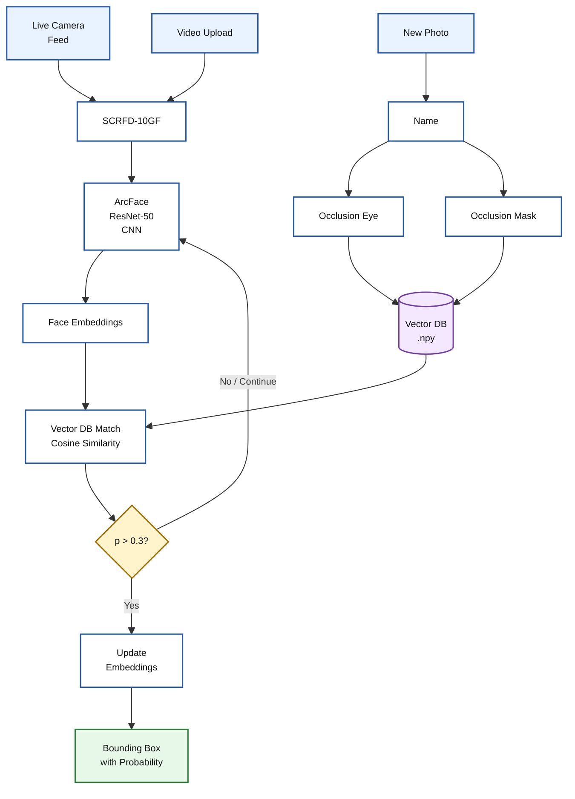

#  Masked Face Recognition System
### Robust Closed-Set Identification, 1:1 Verification, and 1:N Watchlist Search under Extreme Occlusion

[](https://www.python.org/)
[-orange.svg)](https://github.com/deepinsight/insightface)
[]()

---

##  Overview
This projects performs facial recognition on people wearing masks or any other lower face / upper face occlusion as it provides an occlusion-aware face recognition pipeline built on InsightFace's `buffalo_l` ArcFace backbone.
The need for such systems became increasingly evident in the post-COVID-19 era, when mask-wearing became more common in public spaces.
It combines face detection, occlusion-aware enrollment, cosine-similarity matching, and controlled online adaptation to store faces and maintain accuracy .
The system supports live camera feeds, images, and video while handling masked and partially occluded faces.

---
## Real Life Use Cases
  - **Secure Access Control**: Identify authorized personnel entering offices, laboratories, factories, and restricted facilities even when masks or PPE obscure the face.
  - **Security & Surveillance**: Recognize individuals from live CCTV or camera feeds despite masks, changing angles, lighting, and partial facial occlusion.
  - **Healthcare & Industrial PPE**: Maintain reliable identity verification for doctors, workers, and staff wearing masks, respirators, goggles, or other protective equipment.
  - **Watchlist & Investigation**: Search live or recorded video against a known identity database when only partially visible facial features are available.

##  Key Features & Technological Innovations

### 1.  Multi-View Occlusion-Augmented Embeddings ($3 \times 512$ Baseline Matrix)
During identity enrollment (`register_face.py`), the system automatically detects 5 2D facial keypoints (eyes, nose, mouth corners) and synthetically generates occluded variants:
- **Clean Baseline View**: Unoccluded facial image ($1 \times 512$ embedding).
- **Synthetic Eye Occlusion View**: Simulated sunglasses/goggles covering the periocular region ($1 \times 512$ embedding).
- **Synthetic Lower-Face Mask View**: Simulated surgical mask covering from the nose bridge down to the chin ($1 \times 512$ embedding).

These vectors are vertically concatenated into an initial $3 \times 512$ matrix per enrolled identity.

### 2.  Safe Online Learning Architecture (Dynamic In-Memory Memory Adaptation)
During live webcam streams or video playback (`live_recognition.py`, `video_face_recognition.py`), the system dynamically adapts to real-time changes in ambient lighting, facial posture, and camera angles:
- **Recognition Threshold ($\tau_{\text{rec}} = 0.35$)**: Draws green bounding boxes and labels recognized identities. Unknowns below $0.35$ are cleanly suppressed without visual clutter.
- **Safe Online Learning Threshold ($\tau_{\text{learn}} = 0.55$)**: When a live frame scores $\ge 0.55$ (extreme high confidence), the current $1 \times 512$ embedding is appended (`np.vstack`) to the identity's in-memory view matrix.
- **FIFO Buffer (50-View Memory Cap)**: Enforces a strict First-In-First-Out queue capped at 50 views, recycling memory every ~1.6 seconds during continuous streaming.
- **Zero Disk Pollution**: Modifications occur strictly in RAM, preserving original baseline `.npy` gallery files on disk.

### 3.  Robust Multi-Scale Face Detection Engine
To handle low-resolution input, partial occlusions, or small faces distant from the camera, `register_face.py` employs a 3-stage multi-resolution fallback detection pipeline:
1. Standard $640 \times 640$ @ confidence threshold $0.5$
2. Fallback $320 \times 320$ @ confidence threshold $0.3$
3. Fallback $160 \times 160$ @ confidence threshold $0.2$

### 4.  Face Recognition and Recognition Workflows
The repository supports live recognition, static image recognition, video processing, enrollment, and embedding maintenance workflows.

---

##  System Architecture & Operational Pipeline

### 1. Enrollment & Matrix Synthesis Pipeline



---

##  Mathematical Foundations

### 1. Cosine Similarity Formula
Given a live query feature vector $\mathbf{q} \in \mathbb{R}^{512}$ and a stored gallery view vector $\mathbf{v}_j \in \mathbb{R}^{512}$:

$$\text{Similarity}(\mathbf{q}, \mathbf{v}_j) = \frac{\mathbf{q} \cdot \mathbf{v}_j}{\|\mathbf{q}\|_2 \|\mathbf{v}_j\|_2}$$

### 2. Multi-View Maximum Similarity Matching
For an enrolled identity $i$ possessing an $N \times 512$ view matrix :

$$S_i = \max_{j \in \{1, \dots, N\}} \text{Similarity}(\mathbf{q}, \mathbf{v}_{i,j})$$

$$\text{Predicted Identity} = \arg\max_{i} S_i \quad \text{subject to} \quad \max_i S_i \ge \tau_{\text{rec}} = 0.35$$

---

## 📂 Repository Layout & File Responsibilities

```
d:/Masked/
├── faces_db/                            # Storage for identity embedding matrices (.npy)
├── face_database/                       # Raw copy of enrolled facial images
├── Real Images/                         # Enrolled positive gallery images (4,994 images)
├── New_Images/                          # Un-enrolled impostor test set (4,636 images)
├── Masked Images/                       # Occluded test queries (1,138 images across 5 mask types)
│
├── register_face.py                     # Single identity enrollment script (synthesizes 3x512 matrix)
├── batch_register_real_images.py        # Automated bulk enrollment of gallery datasets
├── live_recognition.py                  # Webcam feed recognition + Safe Online Learning
├── recognize_face.py                    # Static single-image query recognition module
├── video_face_recognition.py            # Video file (.mp4) stream processor & renderer
├── reset_embeddings.py                  # Resets memory-expanded matrices back to initial 3 views
├── test.py                              # Master recognition workflow & CSV logger
│
├── online_learning_architecture.md      # Detailed documentation of dynamic memory mechanics
├── requirements.txt                     # Core Python dependencies
└── README.md                            # Main project documentation (this file)
```

---

##  Installation & Setup Guide

### 1. Prerequisites
- **Operating System**: Windows 10/11, Ubuntu 20.04+, or macOS
- **Python**: Version `3.8`, `3.9`, `3.10`, or `3.11` (64-bit)
- **Webcam**: Standard USB or built-in camera (for live streaming)

### 2. Environment Setup

Clone the repository and create a clean Python virtual environment:

```bash
# Navigate to project directory
cd d:/Masked

# Create virtual environment
python -m venv face_env

# Activate virtual environment (Windows PowerShell)
.\face_env\Scripts\Activate.ps1

# Activate virtual environment (Linux/macOS)
source face_env/bin/activate
```

### 3. Install Dependencies

Install the locked dependencies from `requirements.txt`:

```bash
pip install --upgrade pip
pip install -r requirements.txt
```

> **Note:**
> `requirements.txt` includes:
> - `insightface==0.7.3`
> - `onnxruntime==1.16.3`
> - `numpy==1.26.4`
> - `opencv-python`

---

##  Quickstart & Operational Workflows

### Workflow 1: Enrolling a New Person (Single Face)

Run `register_face.py` to register an individual from a single unoccluded image. The script automatically generates eye-occluded and lower-face masked variants and saves a `3 x 512` matrix to `faces_db/<person_name>.npy`.

```bash
python register_face.py
```
*Prompt Input:*
- **Person Name**: `John_Doe`
- **Path to Image**: `path/to/john_photo.jpg`

---

### Workflow 2: Bulk Enrollment of a Dataset Directory

To enroll an entire folder of identity images in batch mode:

```bash
python batch_register_real_images.py
```
*Reads images from `Real Images/` and populates `faces_db/` with baseline matrices.*

---

### Workflow 3: Real-Time Live Webcam Recognition & Online Learning

Launch the interactive webcam recognition system:

```bash
python live_recognition.py
```
- **Display**: Fullscreen window displaying bounding boxes and recognition labels.
- **Controls**: Press **`q`** to quit.
- **Behavior**: Green bounding box drawn for known individuals ($\ge 0.35$). Unknown faces are ignored without visual distraction. High-confidence matches ($\ge 0.55$) trigger safe in-memory embedding learning.

---

### Workflow 4: Processing Video Files (.mp4)

Process an offline video file and render output with bounding boxes:

```bash
python video_face_recognition.py
```
*Processes `input_video.mp4` and exports the recognized video stream to `output_recognized.mp4`.*

---

---

---

### Workflow 7: Maintenance - Resetting Embedding Matrices

If live sessions have expanded memory matrices beyond the baseline views, reset all stored embeddings back to the original $3 \times 512$ matrix shape:

```bash
python reset_embeddings.py
```

---

## 🎛 Hyperparameter & Threshold Configuration

Key system parameters can be adjusted directly in `live_recognition.py` and `video_face_recognition.py`:

```python
# Decision Thresholds
RECOGNITION_THRESHOLD = 0.35  # Cosine similarity boundary for identity match
HIGH_CONF_THRESHOLD   = 0.55  # Boundary for triggering Safe Online Learning

# Memory Constraints
MAX_VIEW_BUFFER_SIZE  = 50    # Maximum number of stored face views per identity (FIFO)

# Detection Parameters
DETECTION_SIZE       = (640, 640) # Input resolution for InsightFace detector
```

---

##  Frequently Asked Questions (FAQ)

<details>
<summary><b>Q: Does this system require GPU acceleration?</b></summary>
<br>
No. The system runs efficiently on CPU using <code>onnxruntime</code> CPU execution providers. Average inference latency is <b>~350 ms per frame</b> on standard multi-core x86 CPUs. GPU execution can be enabled by installing <code>onnxruntime-gpu</code> and setting <code>ctx_id=0</code> in <code>FaceAnalysis.prepare()</code>.
</details>

<details>
<summary><b>Q: How does the system prevent impostors from polluting known identity embeddings?</b></summary>
<br>
Online learning requires a similarity score $\ge 0.55$ (significantly higher than the recognition threshold of $0.35$). Impostor scores typically top out around $0.20 - 0.30$, making it mathematically nearly impossible for an unregistered person to trigger matrix expansion.
</details>

<details>
<summary><b>Q: Why are embeddings updated only in memory during live recognition?</b></summary>
<br>
Keeping updates in RAM ensures maximum execution speed ($O(1)$ matrix slicing) while guaranteeing strict zero disk pollution. Restarting the script cleanly reverts all identities back to their baseline 3-view configuration.
</details>

---

##  License & Acknowledgments

- **Model Backbone**: Powered by [InsightFace (DeepInsight)](https://github.com/deepinsight/insightface) using the `buffalo_l` ArcFace pre-trained weights.
- **License**: Distributed under the [MIT License](LICENSE). Free for academic, research, and commercial applications.
